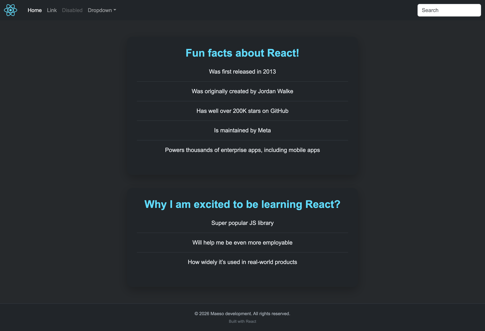

<div align="center">

# Learn React — Scrimba course notes & exercises

### Section 1: Static Pages · IT Academy Barcelona · Sprint 4

First contact with React: JSX, components, props and project structure.


</div>

---

## About this repository

This repository contains the exercises and projects built while following the **[Learn React](https://scrimba.com/learn-react-c0e)** course on Scrimba — Section 1: Static Pages (2.4 hours · Intermediate).

Each commit corresponds to a lesson or challenge from the course, with the code written and iterated during the learning process.

---

## Preview — ReactFacts Project

The main project built throughout Section 1 is **ReactFacts** — a static page that displays fun facts about React and reasons to learn it.

Desktop Preview
 

---

## What I learned

### React fundamentals

- How React works under the hood with `React.createElement()`
- Why JSX exists and how it compiles to JavaScript
- The difference between **composable** (build with components) and **declarative** (describe what you want, not how) UI

### Components

- How to create functional components
- Custom components and how to reuse them
- Parent/child component relationships
- React Fragments to avoid unnecessary wrapper divs
- How to organize components into separate files

### Styling

- How to apply CSS classes in JSX with `className` instead of `class`
- Styling with external CSS files in a Vite + React project
- How to add background images and color bullets with CSS

### Project setup

- Local setup with **Vite** (`npm create vite@latest`)
- Understanding the project structure generated by Vite
- How to run a React project locally with `npm run dev`

---

## Course structure — Section 1: Static Pages

```
learn-react/
└── 01. Static pages/
    ├── 02. What we'll learn
    ├── 03. First React Code
    ├── 04. First React Challenge
    ├── 07. React.createElement()
    ├── 08. JSX
    ├── 09. Why React? It's Composable!
    ├── 10. Why React? It's Declarative!
    ├── 11. Random housekeeping
    ├── 12. ReactFacts Project - Markup
    ├── 13. Pop quiz
    ├── 14. Custom Components
    ├── 15. Custom Components Challenge Part 2
    ├── 16. Custom Components Quiz
    ├── 17. Fragments
    ├── 18. Custom Components - Parent/Child Components
    ├── 19. Styling with Classes
    ├── 20. Organizing Components
    ├── 21. Make Mental Outline of Project
    ├── 22. Initial Project Setup
    ├── 23. ReactFacts Project - Navbar & Styling
    ├── 24. ReactFacts Project - Main Content Section
    ├── 25. ReactFacts Project - Coloring the Bullets
    ├── 26. ReactFacts Project - Add Background Image
    └── 27. Section 1 Recap
```

---

## Tech stack

| Category        | Technology                                     |
| --------------- | ---------------------------------------------- |
| UI Library      | React 18                                       |
| Bundler         | Vite                                           |
| Language        | JavaScript (JSX)                               |
| Styles          | CSS                                            |
| Course platform | [Scrimba](https://scrimba.com/learn-react-c0e) |

---

## Getting started

### Prerequisites

- Node.js >= 18
- npm >= 9

### Run locally

```bash
# 1. Clone the repository
git clone https://github.com/gemmaadev/it-sprint4-first-react-code.git

# 2. Move into the project folder
cd it-sprint4-first-react-code

# 3. Switch to the react-scrimba branch
git checkout react-scrimba

# 4. Install dependencies
npm install

# 5. Start the development server
npm run dev
```

The app will be available at `http://localhost:5173`

---

## Key concepts — quick reference

| Concept       | Description                                                       |
| ------------- | ----------------------------------------------------------------- |
| JSX           | JavaScript + HTML syntax that compiles to `React.createElement()` |
| Component     | A reusable function that returns JSX                              |
| `className`   | How to apply CSS classes in JSX (not `class`)                     |
| Fragment `<>` | Wrapper that doesn't add extra DOM nodes                          |
| Composable    | UI built by combining small, reusable components                  |
| Declarative   | You describe _what_ to render, React handles _how_                |

---

## Author

**Gemma Maeso** · [@gemmaadev](https://github.com/gemmaadev)

Exercises completed as part of the **IT Academy** program by Barcelona Activa · Sprint 4
